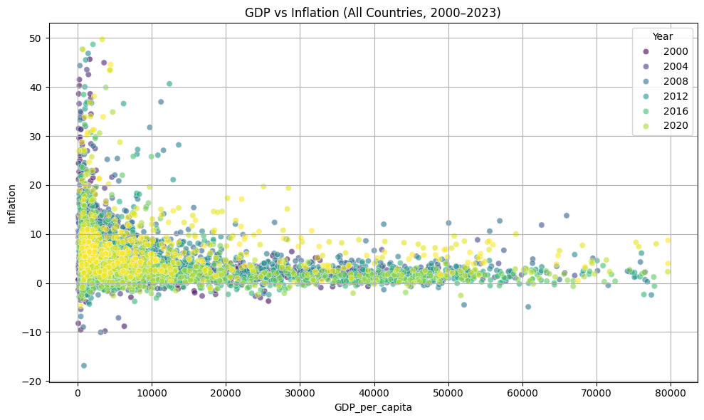
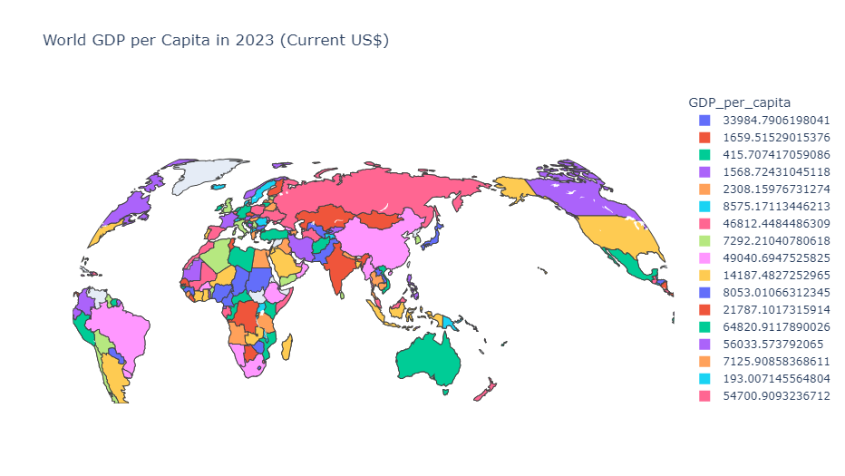
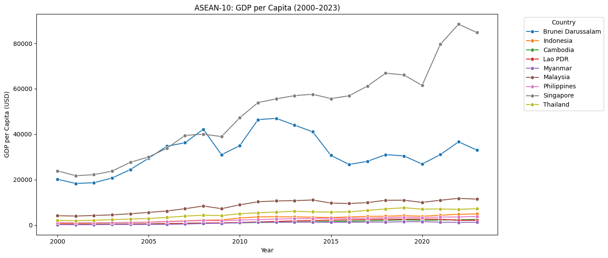
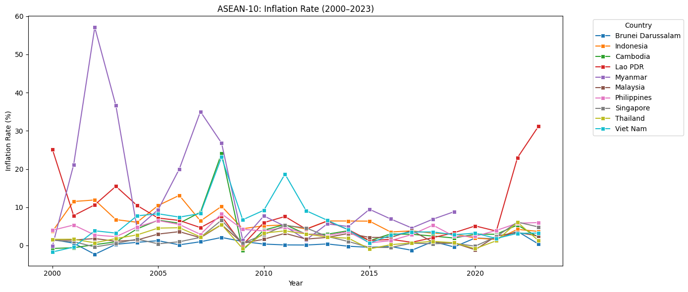
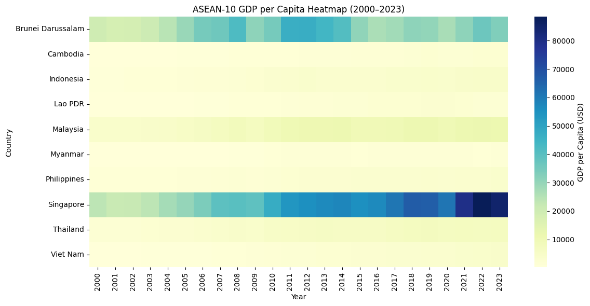
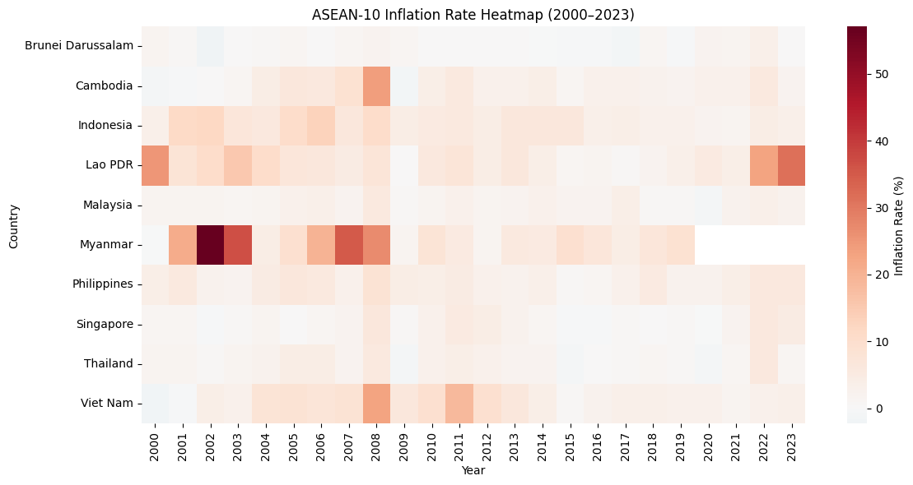
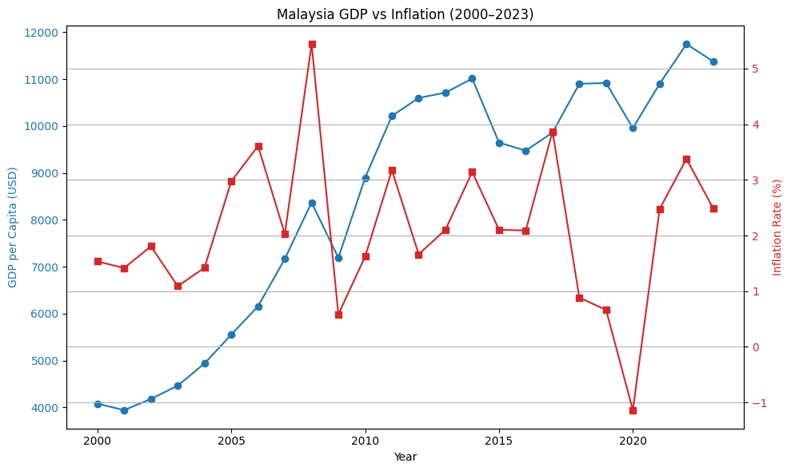
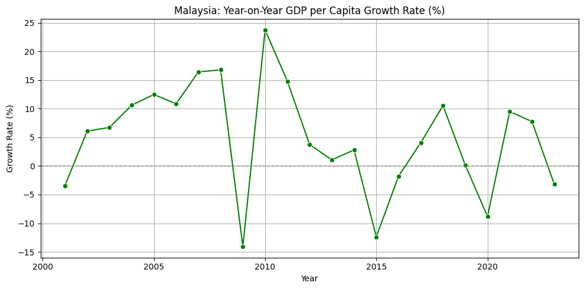
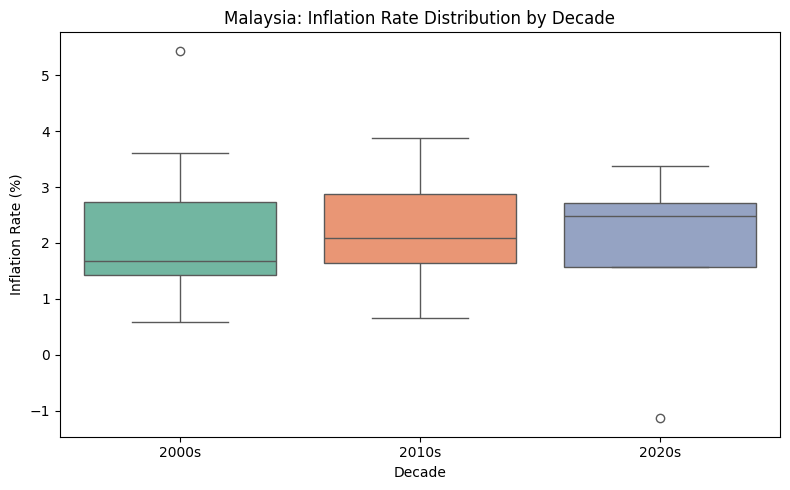

# DATA_MANAGEMENT——Assignment_1

# World Bank GDP & Inflation Analysis (2000–2023)

This project analyzes global and regional economic indicators from 2000 to 2023 using World Bank data, with a focus on the relationship between GDP per capita and inflation across countries. Special emphasis is placed on ASEAN-10 comparisons and an in-depth case study of Malaysia.

---
## Project Objectives

This project aims to:

- Explore the global relationship between GDP per capita and inflation using multi-year data.
- Compare economic patterns among ASEAN-10 countries with visual indicators.
- Conduct a focused analysis of Malaysia's macroeconomic trends in terms of growth quality and price stability.


---

## 📁 Project Structure

```
📁 data/
📁 output/
    └── charts/ (all PNG images)
📄 README.md
📄 assignment_1.ipynb
```

---

##  Tools & Libraries

- Python 3.10+
- Google Colab
- Pandas, Matplotlib, Seaborn, Plotly

---

##  Visualization Summary

The notebook includes 10 main charts categorized by:
- Global correlations
- ASEAN-10 comparisons (line charts & heatmaps)
- Malaysia macroeconomic trends (growth, inflation, stability)

---

##  Chart Previews

### Chart 1 – Global Scatter Plot: GDP vs Inflation (2000–2023)


 This chart shows a moderate negative correlation (**Spearman ρ ≈ –0.40**) between GDP per capita and inflation across countries. The trend is visible but weakened by large inflation volatility in low-income economies.

 
### Chart 2 – World Map: GDP per Capita in 2023


 This choropleth map visualizes GDP per capita in 2023. North America, Western Europe, and parts of East Asia show high income levels, while Sub-Saharan Africa and South Asia remain in the low-income range.  

*Map note: The world map is generated using Plotly's built-in geographic base (based on the [Natural Earth](https://www.naturalearthdata.com/) dataset) and visualized with 2023 GDP per capita data from the World Bank. The map is for data visualization purposes only and does not imply any political stance.*

 ***Note: This map is interactive. The image shown here is a static screenshot. To explore the zoomable and draggable version, please run the corresponding cell in the Notebook.***


### Chart 3 – ASEAN-10: GDP per Capita (2000–2023)


 This chart illustrates the per capita income growth of ASEAN-10 countries over two decades. Singapore and Brunei remain clear leaders, while Malaysia shows steady mid-to-high income progression.

### Chart 4 – ASEAN-10: Inflation Rate (2000–2023)

 This chart shows inflation trends across ASEAN-10 countries. Singapore and Malaysia maintain low and stable rates, while Myanmar and Laos experience significant volatility.
 
### Chart 5 – ASEAN-10 GDP per Capita Heatmap (2000–2023)

 This heatmap illustrates GDP per capita growth across ASEAN-10. Darker cells indicate higher income levels. Malaysia is showing an upward trend.

### Chart 6 – ASEAN-10 Inflation Rate Heatmap (2000–2023)

 This heatmap shows inflation rate fluctuations in ASEAN-10. Myanmar and Laos faced multiple high-inflation periods, while Malaysia and Singapore remained relatively stable.

### Chart 7 – Malaysia: Dual-Axis GDP and Inflation Trend (2000–2023)

 This chart displays Malaysia’s annual GDP per capita and inflation rates using a dual-axis view. GDP shows consistent growth, while inflation remains controlled, with noticeable dips during the 2009 crisis and 2020 pandemic.

### Chart 8 – Malaysia: Year-on-Year GDP per Capita Growth Rate (2000–2023)

This chart highlights Malaysia’s annual per capita GDP growth rate. Major downturns occurred in 2009, 2015, and 2020, but the economy consistently demonstrated strong rebounds afterward.

### Chart 9 – Malaysia: GDP vs Inflation (Area Difference, 2000–2023)
.png)
 This area chart compares GDP per capita and inflation (scaled ×1000), highlighting the “growth vs inflation gap.” A wider area suggests stronger real growth and better inflation management.

 To visualize the relative relationship between GDP per capita and Inflation, I linearly magnified the inflation rate by 1000 times to make it visually close to the GDP level, so that a meaningful area difference map can be constructed. A high magnification (such as ×10000) will cause misleading reversals.

### Chart 10 – Malaysia: Inflation Rate Distribution by Decade (2000–2023)

This boxplot shows Malaysia’s inflation rate trends across the 2000s, 2010s, and 2020s. Although the 2020s group includes only a few years, the distribution appears more concentrated, suggesting improved price stability.


---

##  Conclusion

This project analyzes GDP per capita and inflation trends from 2000 to 2023 using World Bank data, covering global, ASEAN regional, and Malaysia-specific perspectives.

At the global level, GDP and inflation exhibit a moderate negative correlation (Spearman ρ ≈ –0.40), with low-income countries showing greater inflation volatility.

Regionally, ASEAN countries display uneven development—Singapore and Brunei remain high-income, while Myanmar and Laos struggle with inflation instability. Malaysia stands out as a mid-to-high income economy with both growth consistency and monetary stability.

Notably, Malaysia achieved positive GDP-inflation differentials in most years and demonstrated improving price stability, underscoring its maturing macroeconomic management.

---

##  Data Sources

- [World Bank GDP per capita](https://data.worldbank.org/indicator/NY.GDP.PCAP.CD)
- [World Bank Inflation rate](https://data.worldbank.org/indicator/FP.CPI.TOTL.ZG)

---
